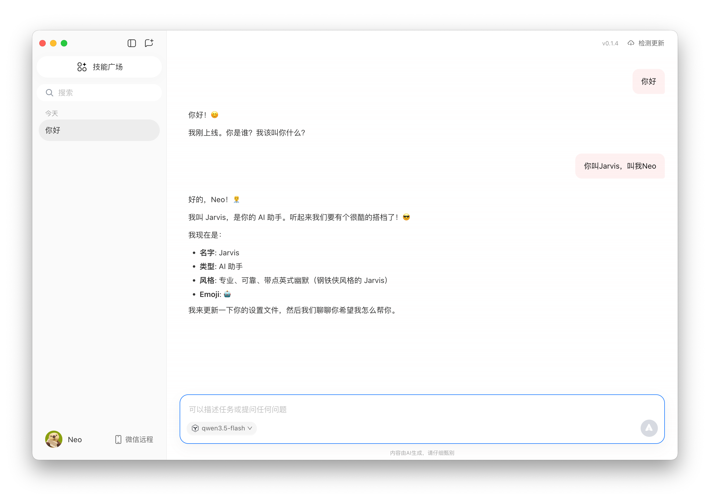
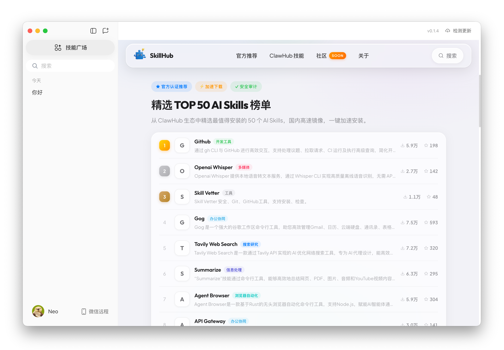

# 🦞 OpenQClaw

> QClaw 今日开放限量内测，OpenQClaw 去除了其内测邀请码限制，现在任何人都可以直接使用微信和 QClaw 聊天啦

## 📌 置顶更新

> **🆕 已同步更新 0.1.5 版本，新增Windows版本，进一步完善部分功能并修复已知问题。**

  
  &nbsp;&nbsp;
  

> 遇到连接失败 / 提示强制更新 / 更新后失效 / API 报错 403 / 微信远程控制失效等问题，**请查阅 [FAQ 常见问题解答](FAQ.md)**。
>
> QClaw 原版应用仍处于快速迭代阶段，目前功能尚不完善，存在较多已知问题。我们会持续跟进其更新，维护无需内测邀请码即可使用的 OpenQClaw，直到官方正式开放公测。
>
> 如果想要体验小龙虾，也可以选择其他更成熟的 Claw 类产品，建议配合支持**流式输出**和**在线文档**等特性的消息渠道使用 — 毕竟"小而美"甚至不支持流式回复和在线文档等基础能力。
>
> 使用过程中遇到任何问题，欢迎扫码加入微信交流群，一起交流讨论 👇

  

  
  &nbsp;&nbsp;
  

  

## 🔒 Before → 🔓 After

  
  &nbsp;&nbsp;
  

  <em>左：原版需要邀请码 → 右：OpenQClaw 直接进入主界面</em>

## 💬 效果展示

  

## 📖 什么是 QClaw？

[QClaw](https://claw.guanjia.qq.com/) 是**腾讯电脑管家官方出品**的全能电脑 AI 助手，核心特性：

- 🦞 **微信直联** — 通过微信远程操控电脑，随时随地让 AI 干活
- 📦 **开箱即用** — 内置国产优质大模型，支持切换自定义模型
- 🔧 **5000+ Skills** — 支持 ClawHub、GitHub 等丰富 Skills 生态
- 🧠 **持续记忆** — 记住偏好和上下文，最懂你的 AI
- 💻 **本地操控** — 直接操控文件、浏览器、邮件，不只是聊天

目前 QClaw 处于**邀请制内测**阶段，需要邀请码才能使用。**OpenQClaw 去除了这一限制。**

## 🚀 使用方法

1. 从 [Releases](https://github.com/haroldneo/OpenQClaw/releases) 下载对应平台的安装包：
   - macOS Apple Silicon: `OpenQClaw-0.1.5-arm64.app.zip`
   - macOS Intel: `OpenQClaw-0.1.5-x64.app.zip`
   - Windows: `OpenQClaw-0.1.5-windows.zip`
2. **macOS：** 解压后将 `OpenQClaw.app` 拖入 `/Applications`，首次打开如遇安全提示，前往 **系统设置 → 隐私与安全性** 点击「仍要打开」
3. **Windows：** 解压后直接运行 `QClaw.exe`
4. 微信扫码登录，即可开始使用 🎉

## 🔧 技术原理

QClaw 基于 Electron 构建，前端邀请码验证与启动更新检测逻辑位于 `app.asar` 内的 renderer 层：

1. **提取** `app.asar` 获取前端源码
2. **定位** `Chat` 组件中的 `checkInviteCode` 调用、`WXLoginView` 登录后校验，以及更新检测弹窗逻辑
3. **Patch** 邀请码校验逻辑：
   - `Chat` chunk — 将邀请码状态 `isInviteVerified` 初始化为 `true`，跳过 API 校验
   - `WXLoginView` chunk — 将登录后的邀请码检查直接放行
4. **Patch** 更新检测逻辑：
   - 移除启动时自动执行的版本检查
   - 将更新弹窗改为始终可关闭，不再因 `force` 策略阻止继续使用
5. **移除** `Info.plist` 中的 `ElectronAsarIntegrity` 哈希校验
6. **重新打包** asar 并 ad-hoc 签名

## ⚠️ 免责声明

本项目仅供学习和研究目的。QClaw 的所有权利归腾讯公司所有。使用本项目即表示你了解并接受相关风险。

## 📄 License

MIT
